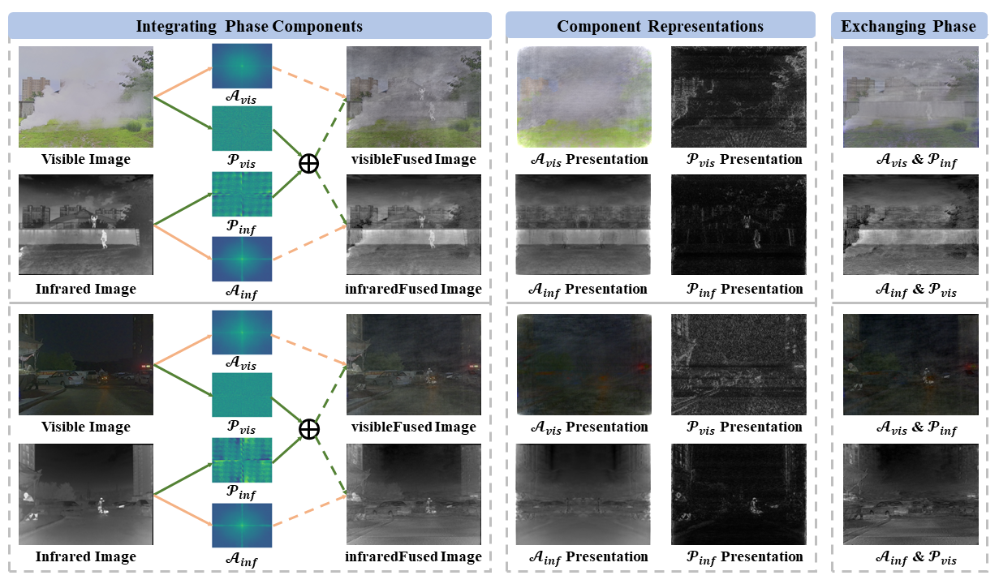
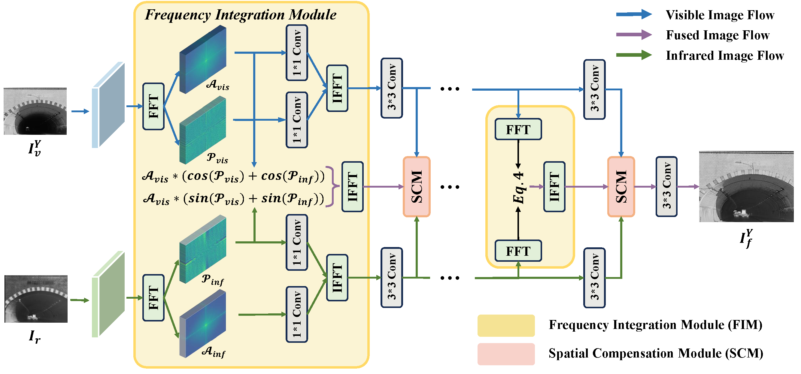

# Frequency Integration and Spatial Compensation Network for Infrared and Visible Image Fusion

Naishan Zheng, Man Zhou, Jie Huang, Feng Zhao

 University of Science and Technology of China

---
>Infrared and visible image fusion aims to synthesize a fused image that emphasizes the salient objects while retaining the intricate texture and visual quality from both infrared and visible images. In opposite to the majority of existing deep learning-based fusion approaches, which predominantly focus on spatial information and neglect the valuable frequency information, we propose a novel method that delves into both domains simultaneously to tackle the infrared and visible image fusion task. Specifically, we first analyze the frequency characteristics of the two modality images via Fourier transform, and observe that fusion results with complementary attributes  from source images can be effectively attained by directly incorporating their phase components. To this end, we propose a Frequency Integration and Spatial Compensation Network (FISCNet), consisting of two core designs: a frequency integration component and a spatial compensation component. The former integrates prominent objects from the source images while maintaining the visual perception from the visible image in the frequency domain, and the latter improves the detailed texture  and emphasizes the salient objects through a meticulous compensation mechanism in the spatial domain. Extensive experiments on various benchmarks demonstrate the superiority of our method over state-of-the-art alternatives in terms of both salience preservation and texture fidelity.
---




## 🚀: How to test

1. Update the paths of image sets and pre-trained models.
 ```
Updating the paths in configure files of /FISCNet/options/test/FISCNet.yml
```

2. Run the testing commands.
 ```
python test.py -opt /FISCNet/options/test/FISCNet.yml
```

## 🚀: How to train

1. Download saliency maps on the M3FD dataset from [Google Drive](https://drive.google.com/drive/folders/1CIsMmt6XZH4UMjca4K1DhLew_xNGrXv0?usp=drive_link) or run VSM.m to generate maps for your own data.

2. Update the paths of image sets in the training configuration.
 ```
Updating the paths in configure files of /FISCNet/options/train/FISCNet.yml
```

3. Run the testing commands.
 ```
python train.py -opt /FISCNet/options/train/FISCNet.yml
```
